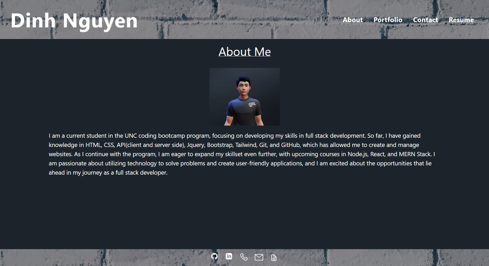
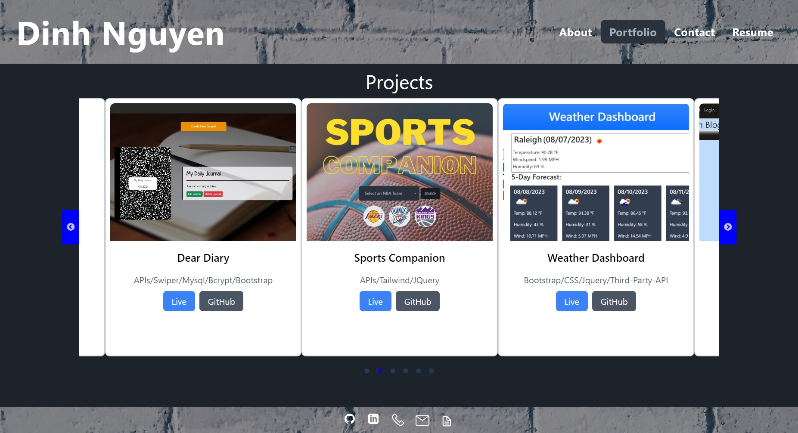
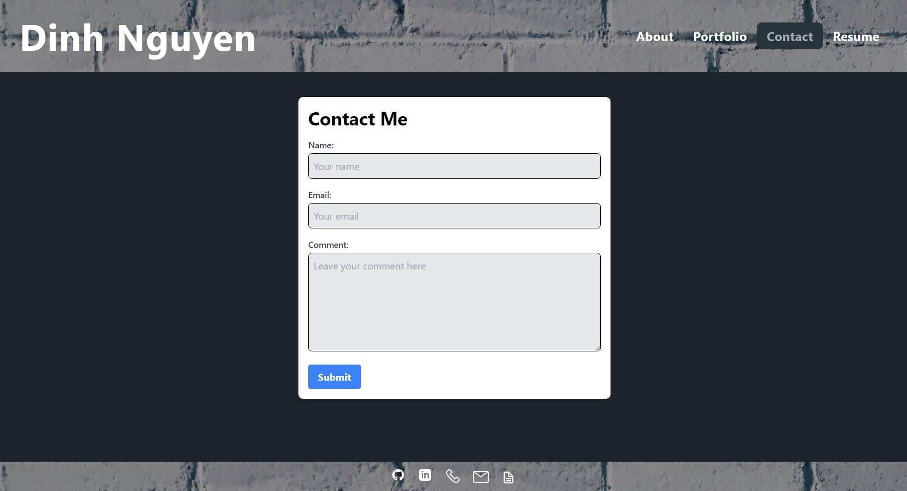
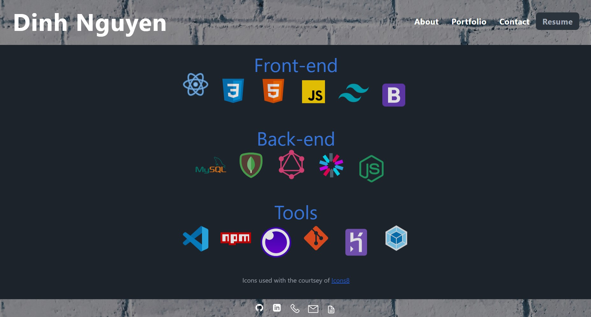

# React-Portfolio

## Description

In this project, I crafted an engaging single-page application (SPA) portfolio utilizing the power of React. Since the nature of the application is a static webpage, my choice for deployment fell upon Netlify. The platform's seamless integration for form submission handling proved to be a perfect fit, especially considering that my portfolio features a contact form, enabling visitors to conveniently reach out.

During the development of this SPA, I embarked on a journey of discovery, delving into a plethora of new tools and concepts. My proficiency with React components grew significantly, allowing me to master the art of managing application states and orchestrating the seamless flow of data across various parts of the application. This immersive experience provided me with an insightful grasp of React's underlying mechanics and its pivotal role in addressing contemporary challenges in web development. The veil was lifted, revealing JSX's instrumental role in rendering elements on the web page. This project afforded me invaluable opportunities to refine my skill in code modularization and the creation of reusable components within the React ecosystem.

## Table of Contents
1. [Installation](#installation)
2. [Usage](#usage)
3. [Credits](#credits)
4. [Questions](#questions)  
5. [License](#license)

## Installation
- Download and install the Node.js LTS version from [Node.js](https://nodejs.org/en).
- Clone the repo using:

        git@github.com:Dinh282/react-portfolio.git

- Or download the code from https://github.com/Dinh282/react-portfolio.git and
open it with VS Code.  
- Make sure you are in the root path of the project folder and install dependencies for the project with:

        npm i

- After installing the dependencies you can run the following command:

        npm run dev

- The npm run dev command will start the app and open your browser to localhost:3000/, the homepage(also the about page) of the portfolio.

## Usage
- Once on the website, feel free to explore the portfolio by using the nav bar at the top. 
- Clicking on the titles in the nav bar will take you to the different pages. 
- The portfolio page contains a slide show that showcases previous projects. You can visit each of the project's live sites by clicking on the live button or their GitHub repository by clicking on the GitHub button. 
- You can use the dev tools to adjust the screen's width and see how the app's responsiveness is handled.

- Alternatively, you can interact with the portfolio by visiting https://steady-dodol-c548a3.netlify.app 

or view the demo video below:

https://github.com/Dinh282/react-portfolio/assets/112836220/f05e5601-35df-42fe-a54e-0abd8681b120

The following screenshots are of the webpages of the portfolio:

Screenshot of About Me Page:

Screenshot of Portfolio Page:

Screenshot of Contact Page:

Screenshot of ResumePage:

## Credits:
1. https://www.reshot.com/ (SVG icons)

2. https://www.youtube.com/watch?v=Ul3y1LXxzdU&list=PLgSW_umqodUpWypzxtaqSTVNjqmsuPrzA&index=8 (Help with React Router)

3. https://www.youtube.com/watch?v=VAeRhmpcWEQ&t=433s (Help with React-Vite)

4. https://iconmonstr.com/ (SVG icons)

5. https://icons8.com/icons/set/github (SVG icons)

6. https://react-slick.neostack.com/ (React Slick Docs)

7. https://tailwind-elements.com/docs/standard/components/carousel/#docsTabsOverview (Tailwind Docs)

8. https://www.youtube.com/watch?v=FdrEjwymzdY (Help with Framer Motion for page animation)

9. https://www.framer.com/motion/ (Framer Motion Docs)

10. https://uxwing.com/react-js-icon/ (Svg Icons)

11. https://vitejs.dev/guide/static-deploy.html#netlify (Help with deploying to Netlify)

12. https://docs.netlify.com/forms/setup/ (Netlify docs helps with Netlify and )

13. Instructor, TAs, and classmates.

## Questions
Feel free to contact me at nguyen_dinh282@yahoo.com for additional information.  
Also, check out my other projects on [GitHub](https://github.com/Dinh282)

## License

Please refer to the LICENSE section in the repository.

---
